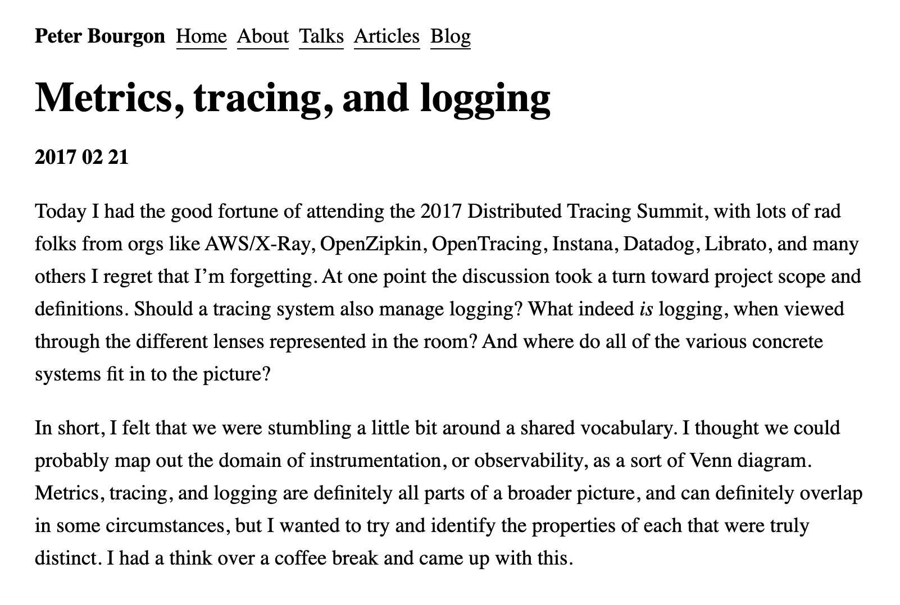
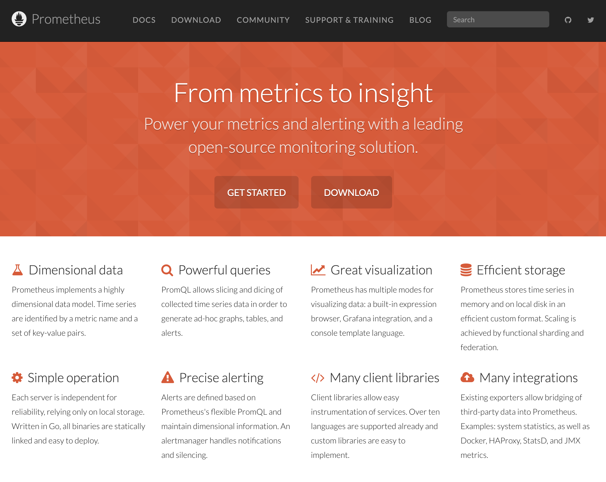
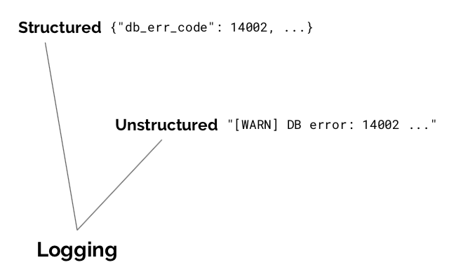
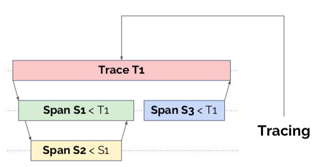
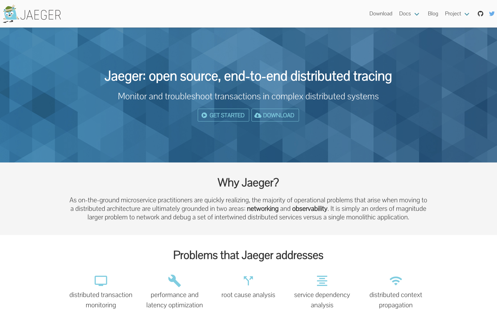
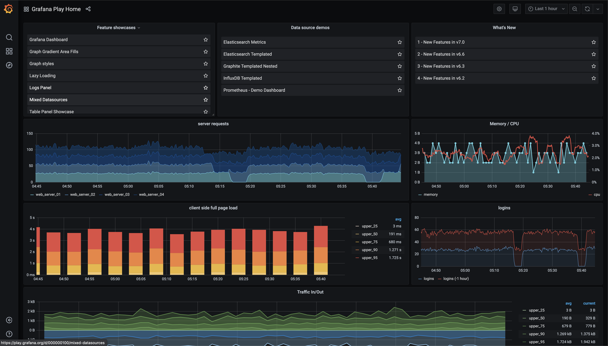
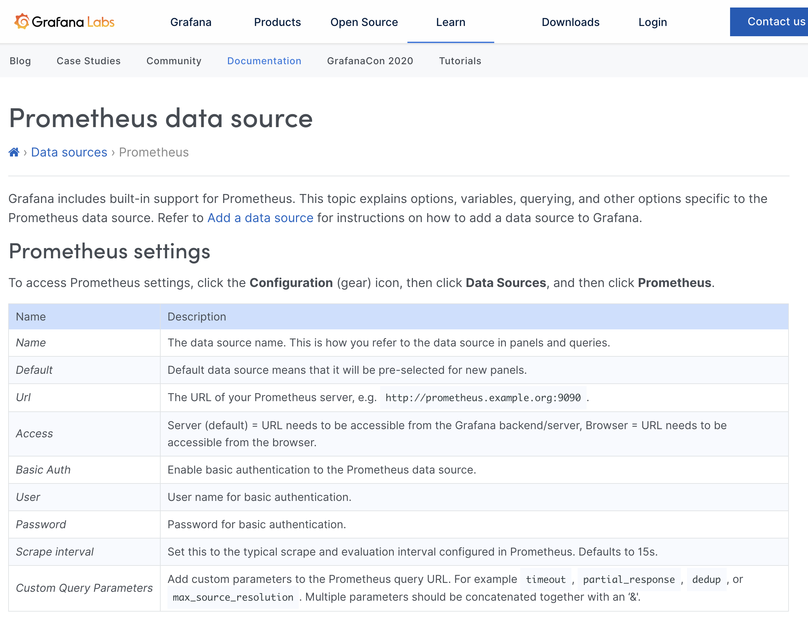
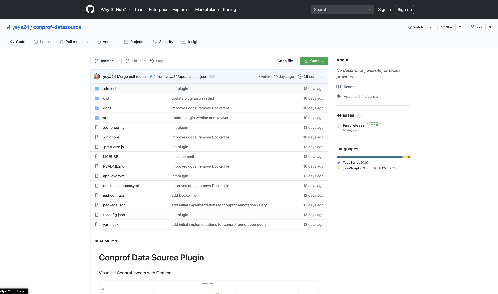
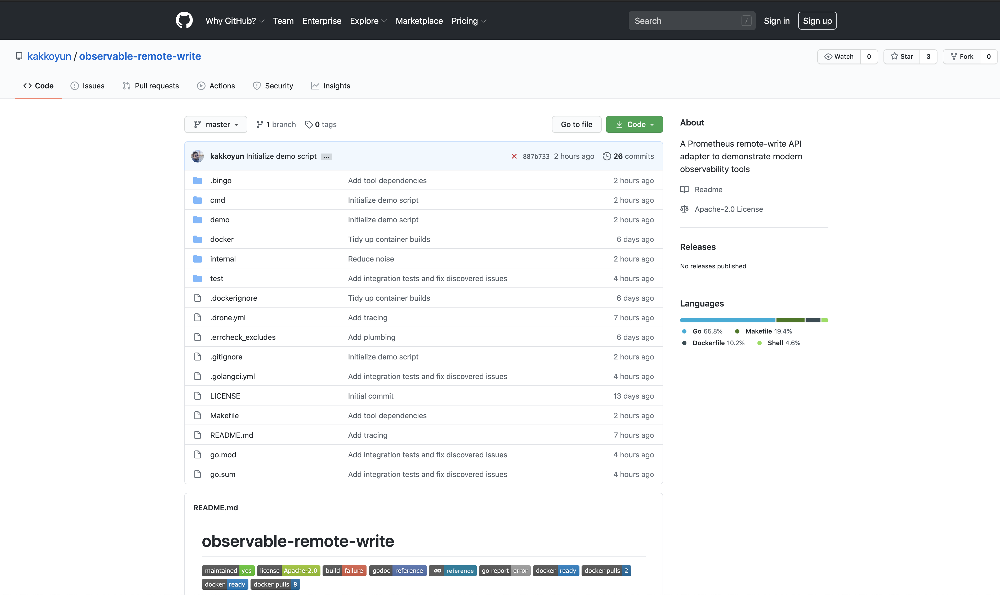

# Building *Observable* Go Services

#### [GopherCon Turkey](https://gophercon.ist/en) - 2020

Note:

- Hello everyone
- BREATH
- Today I'm gonna talk about observability.
- Hopefully at the end of the talk you will have an idea about what is observability
- And how to build observable Go services
- BREATH
- First, who am I?

---?image=assets/img/avatar.compressed.jpg&position=right&size=48% 100%

@snap[north-west span-40 text-left text-07]

### Who am I?

@snapend

@snap[west span-60 text-left text-07]
SWE/SRE **@Red Hat**
Observability Platform Team
**Thanos** Maintainer
**Promethues** Contributor

@snapend

@snap[south-west span-50 text-left text-07]
@fa[twitter] kkakkoyun
@fa[github] kakkoyun
@snapend

Note:

- My name is Kemal
- And I work for Red Hat as a software engineer at Red Hat
- My team is responsible of building a platform to collect and store observability, signals such as metrics, logs, tracing and profilling.
- BREATH
- This platform is made of all Open source tools and projects.
- So we all contribute to them.
- BREATH
- As a team we also have SRE responsibilities, we are on-call for the platform that we are building
- So we are already using the practices that I'm gonna show today
- BREATH
- Also I'm a Thanos maintainer and recently started to contribute Prometheus,
- Besides observability and monitoring topics, I'm also passionate about distributed systems and databases
- I participate in SIG Observability and Kubernetes SIG Instrumentation

---

### What is **Observability?**

---

@quote[In control theory, observability is a measure of how well internal states of a system can be inferred from knowledge of its external outputs.](Wikipedia)

Note:

- It is basically an ability to ask questions to your running system.
- Is the system currently healthy?
- If not, why not? Where can we begin debugging?
- So that it could help us to troubleshoot our system when it is needed.

---

[Observability 101 @fa[external-link]](https://www.youtube.com/watch?v=6XkWkd3j5fI)


Note:

- You can check this amazing talk if you want to dig more on what observability is.

---

### What does a properly **observable system** in Go look like?

Note:

- For most of our systems, good observability is simply more important than good testing,
- because good observability enables smart organizations to focus on fast deployment and rollback.
- I guess there’s no single answer, no package I can tell you to import to solve the problem once and for all.
- The observability space is fractured, with many vendors competing for their particular worldview.

---

### The Pillars of **Observability**

Note:

- The Three pillars of Observability
- Aggregated Observations
- Discreate Events

---?image=assets/img/pillars_with_background.png&size=65%

Note:

- Metrics: Numerical data, easy to scale, you can do math with them
- Logs: Mostly test, rich with metadata, scales linearly, can be noisy sometimes
- Traces: Execution path of your program, Annotated, Rich, but extremely expensive

- Metrics: Good for alerting, dashboards and expolaration
- Logs: for establishing order of events, detailed information
- Traces: Useful to understand the system and why individual systems behaves as it is

---

[Metrics, tracing, and logging @fa[external-link]](https://peter.bourgon.org/blog/2017/02/21/metrics-tracing-and-logging.html)



Note:

- You can more on this at following link.

---

### Everything starts with **Instrumentation**

Note:

- Everything starts with Instrumentation
- So we will do so!

---?image=assets/img/arch_diagram_with_background.png&size=80%

Note:

- We will work on a demo application that conform prometheus remote write protocol

---?image=assets/img/scrape_with_background.png&size=80%

### Health checks

Note:

- Providing a basic health check for our system always helps
- and it is a very low hanging fruit
- so lets add it

---

```golang
// NewServer creates a new internal server that exposes debug probes.
func NewServer(reg prometheus.Gatherer, listen, healthcheckURL string) *http.Server {
	// Internal server to expose introspection APIs.
	mux := http.NewServeMux()

	// Initialize health checks.
	healthchecks := healthcheck.NewHandler()

	// Register health check endpoints.
	mux.Handle("/-/healthy", http.HandlerFunc(healthchecks.LiveEndpoint))
	mux.Handle("/-/ready", http.HandlerFunc(healthchecks.ReadyEndpoint))

	return &http.Server{
		Addr:    listen,
		Handler: mux,
	}
}
```

Note:

- We will expose a dedicated http server for debugging events
- and it will check our public server

---

```console
➜ curl localhost:8081/-/heathy
{
    "http": "OK"
}

➜ curl localhost:8081/-/ready
{
    "http": "OK"
}
```

Note:

- So these endpoint could be used by our infrastructure to do its magic
- Like routing traffic or restarting in-case of a failure.

---

[metalmatze/signal @fa[external-link]](https://github.com/metalmatze/signal)

[heptio/healthcheck @fa[external-link]](https://github.com/heptiolabs/healthcheck)

Note:

- Useful libraries, if you don't want to reinvent the wheel

---

### Metrics

---


Note:

- As we talked about earlier, cheapest of the signals
- And it is relatively easy to add
- For this we will use prometheus

---

[Prometheus @fa[external-link]](https://prometheus.io/)



Note:

- Prometheus is a free software application used for event monitoring and alerting.
- A graduated CNCF project.

---

[prometheus/client_golang @fa[external-link]](https://github.com/prometheus/client_golang)

---

```golang
package main

import "github.com/prometheus/client_golang/prometheus"

func main() {
    // Start metric registry.
    reg := prometheus.NewRegistry()

    // Register metrics server.
    http.Handle("/metrics", promhttp.HandlerFor(reg, promhttp.HandlerOpts{}))
    http.ListenAndServe(":8080", nil)
}
```

---

```console
➜ curl localhost:8081/metrics
# HELP go_gc_duration_seconds A summary of the pause duration of garbage collection cycles.
# TYPE go_gc_duration_seconds summary
go_gc_duration_seconds{quantile="0"} 0
go_gc_duration_seconds{quantile="0.25"} 0
go_gc_duration_seconds{quantile="0.5"} 0
go_gc_duration_seconds{quantile="0.75"} 0
go_gc_duration_seconds{quantile="1"} 0
go_gc_duration_seconds_sum 0
go_gc_duration_seconds_count 0
...
```

---

```golang
import (
	"github.com/povilasv/prommod"
	"github.com/prometheus/common/version"
)

serviceName = "observable_remote_write_backend"

func main() {
    reg := prometheus.NewRegistry()

    // Register standard Go metric collectors, which are by default registered when using global registry.
    reg.MustRegister(
        prometheus.NewGoCollector(),
        version.NewCollector(serviceName),
        prommod.NewCollector(serviceName),
        prometheus.NewProcessCollector(prometheus.ProcessCollectorOpts{}),
    )
    ...
}
```

---?image=assets/img/prom_build_info.png&size=50%

---?image=assets/img/prom_go_collector.png&size=25%

---?image=assets/img/prom_mod_info.png&size=80%

---

@snap[north span-100]
#### Power of Middlewares
@snapend

```golang
package middleware

import (
	"github.com/prometheus/client_golang/prometheus"
)

type MetricsMiddleware struct {
	requestDuration *prometheus.HistogramVec
	requestSize     *prometheus.SummaryVec
	requestsTotal   *prometheus.CounterVec
	responseSize    *prometheus.SummaryVec
}
```

---

@snap[north span-100]
#### Power of Middlewares
@snapend

```golang
    requestDuration: promauto.With(reg).NewHistogramVec(
        prometheus.HistogramOpts{
            Name:    "http_request_duration_seconds",
            Help:    "Tracks the latencies for HTTP requests.",
            Buckets: []float64{0.001, 0.01, 0.1, 0.3, 0.6, 1, 3, 6, 9, 20, 30, 60, 90, 120},
        },
        []string{"code", "handler", "method"},
    ),

    requestSize: promauto.With(reg).NewSummaryVec(
        prometheus.SummaryOpts{
            Name: "http_request_size_bytes",
            Help: "Tracks the size of HTTP requests.",
        },
        []string{"code", "handler", "method"},
    ),
```

---

@snap[north span-100]
#### Power of Middlewares
@snapend

```golang
import (
	"github.com/prometheus/client_golang/prometheus"
	"github.com/prometheus/client_golang/prometheus/promauto"
	"github.com/prometheus/client_golang/prometheus/promhttp"
)

func (ins *MetricsMiddleware) NewHandler(handlerName string) func(next http.Handler) http.Handler {
	return func(handler http.Handler) http.Handler {
		return promhttp.InstrumentHandlerDuration(
			ins.requestDuration.MustCurryWith(prometheus.Labels{"handler": handlerName}),
			promhttp.InstrumentHandlerRequestSize(
				ins.requestSize.MustCurryWith(prometheus.Labels{"handler": handlerName}),
					promhttp.InstrumentHandlerResponseSize(
						ins.responseSize.MustCurryWith(prometheus.Labels{"handler": handlerName}),
						handler,
					),
				),
		)
	}
}
```

---

@snap[north span-100]
#### Power of Middlewares
@snapend

```golang
metrics := middleware.NewMetricsMiddleware(reg)

// Main server to listen for public APIs.
mux := http.NewServeMux()
mux.Handle("/receive",
    metrics.NewHandler("receive")(receiver.Receive),
)

srv := &http.Server{
    Addr:    cfg.server.listen,
    Handler: mux,
}

srv.ListenAndServe()
```

---?image=assets/img/prom_ui.png&size=90%

---

### Logs

---



Note:

- For log files to be machine-readable more advanced functionality, they need to be written in a structured format that can be easily parsed.
- Structured logging can be used for a couple different use cases:
- Process log files for analytics
- Searching log files

---

[go-kit/logger @fa[external-link]](https://github.com/go-kit/kit/tree/master/log)

[uber/zap @fa[external-link]](https://github.com/uber-go/zap)

Note:

- TODO

---

```golang
func NewLogger(logLevel, logFormat, debugName string) log.Logger {
	var (
		logger log.Logger
		lvl    level.Option
	)

	switch logLevel {
	case "error":
		lvl = level.AllowError()
	case "warn":
		lvl = level.AllowWarn()
	case "info":
		lvl = level.AllowInfo()
	case "debug":
		lvl = level.AllowDebug()
	default:
		panic("unexpected log level")
	}

	logger = level.NewFilter(logger, lvl)
    return log.With(
        logger,
        "ts", log.DefaultTimestampUTC,
        "caller", log.DefaultCaller,
    )
}
```

---

```golang
func main() {
    // Initialize structured logger.
    logger := internal.NewLogger(
        cfg.logLevel,
        cfg.logFormat,
        cfg.debug.name,
    )
    defer level.Info(logger).Log("msg", "exiting")
}
```

---

```golang
level.Warn(logger).Log("msg", "http read", "err", err)
level.Warn(logger).Log("msg", "snappy decode", "err", err)
level.Warn(logger).Log("msg", "proto unmarshalling", "err", err)
level.Info(logger).Log("msg", "remote write request received")
level.Debug(logger).Log("msg", m)
level.Debug(logger).Log("msg", fmt.Sprintf("  %f %d", s.Value, s.Timestamp))
```

---

```console
level=info name=observable-remote-write-backend ts=2020-07-24T17:44:37Z
caller=main.go:127 msg="starting server"

level=info name=observable-remote-write-backend ts=2020-07-24T17:44:53Z
caller=receiver.go:64 msg="remote write request received"
```

---

@snap[north span-100]
#### Power of Middlewares
@snapend

```golang
// Logger returns a middleware to log HTTP requests.
func Logger(logger log.Logger) func(next http.Handler) http.Handler {
	return func(next http.Handler) http.Handler {
		return http.HandlerFunc(func(w http.ResponseWriter, r *http.Request) {
			start := time.Now()

            next.ServeHTTP(w, r)
            ...
			keyvals := []interface{}{
				"request", RequestIDFromContext(r.Context()),
				"proto", r.Proto,
				"method", r.Method,
				"path", r.URL.Path,
				"duration", time.Since(start),
            }

			level.Debug(logger).Log(keyvals...)
		})
	}
}
```

---

```golang
metrics := middleware.NewMetricsMiddleware(reg)

// Main server to listen for public APIs.
mux := http.NewServeMux()
mux.Handle("/receive",
    middleware.RequestID(
        middleware.Logger(logger)(receiver.Receive),
    ),
)

srv := &http.Server{
    Addr:    cfg.server.listen,
    Handler: mux,
}

srv.ListenAndServe()
```

---

@snap[north span-100]
#### Power of Middlewares
@snapend

```golang
// RequestID returns a middleware that sets a unique request id for each request.
func RequestID(h http.Handler) http.Handler {
	return http.HandlerFunc(func(w http.ResponseWriter, r *http.Request) {
		reqID := r.Header.Get("X-Request-ID")
		if reqID == "" {
			entropy := ulid.Monotonic(rand.New(rand.NewSource(time.Now().UnixNano())), 0)
			reqID := ulid.MustNew(ulid.Timestamp(time.Now()), entropy)
			r.Header.Set("X-Request-ID", reqID.String())
		}
		ctx := newContextWithRequestID(r.Context(), reqID)
		h.ServeHTTP(w, r.WithContext(ctx))
	})
}
```

---

[loki @fa[external-link]](https://grafana.com/oss/loki/)


---?image=assets/img/loki_log_panel.png&size=90%

---

### Tracing

---



Note:

- Most costly but richest

---

[jaeger @fa[external-link]](https://www.jaegertracing.io/)



---

```golang
// Create and install Jaeger export pipeline.
traceProvider, closer, err := jaeger.NewExportPipeline(
    jaeger.WithCollectorEndpoint("http://127.0.0.1:14268/api/traces"),
    jaeger.WithProcess(jaeger.Process{
        ServiceName: serviceName,
        Tags: []kv.KeyValue{
            kv.String("exporter", "jaeger"),
        },
    }),
    jaeger.WithSDK(&sdktrace.Config{DefaultSampler: sdktrace.AlwaysSample()}),
)
if err != nil {
    stdlog.Fatalf("failed to initialize tracer, err: %v", err)
}

defer closer()

tracer := traceProvider.Tracer(serviceName)
```

---

```golang
func Receive(logger log.Logger, tracer trace.Tracer) http.HandlerFunc {
	return func(w http.ResponseWriter, r *http.Request) {
		ctx, span := tracer.Start(r.Context(), "receive")
		defer span.End()

        ...

        var reqBuf []byte

		if err := tracer.WithSpan(ctx, "decode", func(ctx context.Context) error {
			var err error
			reqBuf, err = snappy.Decode(nil, compressed)
			return err
		}); err != nil {
			level.Warn(logger).Log("msg", "snappy decode", "err", err)
			http.Error(w, err.Error(), http.StatusBadRequest)

			return
		}
        ...
    }
}
```

---

```golang
func Receive(logger log.Logger, tracer trace.Tracer) http.HandlerFunc {
	return func(w http.ResponseWriter, r *http.Request) {
		ctx, span := tracer.Start(r.Context(), "receive")
		defer span.End()

		...

		var req prompb.WriteRequest

		if err := tracer.WithSpan(ctx, "unmarshal", func(ctx context.Context) error {
			return proto.Unmarshal(reqBuf, &req)
		}); err != nil {
			level.Warn(logger).Log("msg", "proto unmarshalling", "err", err)
			http.Error(w, err.Error(), http.StatusBadRequest)

			return
        }
    }
}
```

---

@snap[north span-100]
#### Power of Middlewares
@snapend

```golang
// Tracer returns an HTTP handler that injects the given tracer and starts a new server span.
// If any client span is fetched from the wire, we include that as our parent.
func Tracer(logger log.Logger, tracer trace.Tracer, name string) func(next http.Handler) http.Handler {
	operation := fmt.Sprintf("/%s HTTP[server]", name)
        ...
		return http.HandlerFunc(func(w http.ResponseWriter, r *http.Request) {
			ctx := r.Context()
			attrs, entries, spanCtx := httptrace.Extract(ctx, r)
			r = r.WithContext(correlation.ContextWithMap(ctx, correlation.NewMap(correlation.MapUpdate{
				MultiKV: entries,
			})))

            ...
		})
	}
}
```

---

```golang
// Tracer returns an HTTP handler that injects the given tracer and starts a new server span.
// If any client span is fetched from the wire, we include that as our parent.
func Tracer(logger log.Logger, tracer trace.Tracer, name string) func(next http.Handler) http.Handler {
	operation := fmt.Sprintf("/%s HTTP[server]", name)
        ...
		return http.HandlerFunc(func(w http.ResponseWriter, r *http.Request) {
			...

			ctx, span := tracer.Start(
				trace.ContextWithRemoteSpanContext(ctx, spanCtx),
				name,
				trace.WithAttributes(attrs...),
			)
			defer span.End()

			span.AddEvent(ctx, operation)

			next.ServeHTTP(w, r.WithContext(ctx))
		})
	}
}
```

---?image=assets/img/jaeger_ui.png&size=90%

---?image=assets/img/jaeger_thanos.png&size=90%

---?image=assets/img/jaeger_thanos_detail.png&size=80%

---


Note:

- There is another talk today dedicated to tracing
- If you are interested I highly recommend

---

### Profiling

Note:

- Last but not least
- Not a pillar but sometimes the most helpful
- Getting the snaphots of used resources from a running system

---

```golang
func main() {
    debug := os.Getenv("DEBUG") != ""
    if debug {
        runtime.SetMutexProfileFraction(cfg.debug.mutexProfileFraction)
        runtime.SetBlockProfileRate(cfg.debug.blockProfileRate)
    }
}
```

---

```golang
import "net/http/pprof"

// Internal server to expose introspection APIs.
mux := http.NewServeMux()

// Register pprof endpoints.
mux.HandleFunc("/debug/pprof/", pprof.Index)
mux.HandleFunc("/debug/pprof/cmdline", pprof.Cmdline)
mux.HandleFunc("/debug/pprof/profile", pprof.Profile)
mux.HandleFunc("/debug/pprof/symbol", pprof.Symbol)
mux.HandleFunc("/debug/pprof/trace", pprof.Trace)
```

---?image=assets/img/pprof_debug.png&size=80%

---

[Profiling Go with pprof @fa[external-link]](https://jvns.ca/blog/2017/09/24/profiling-go-with-pprof/)


Note:

- More on this

---

### Continues Profiling

Note:

- Why?
Before explaining how you can use the profiler in production, it would be helpful to explain why you would ever want to profile in production. Some very common cases are:
Debug performance problems only visible in production.
Understand the CPU usage to reduce billing.
Understand where the contention cumulates and optimize.
Understand the impact of new releases, e.g. seeing the difference between canary and production.
Enrich your distributed traces by correlating them with profiling samples to understand the root cause of latency.

---

[Continues Profiling Go Programs @fa[external-link]](https://medium.com/google-cloud/continuous-profiling-of-go-programs-96d4416af77b)


---

[Conprof @fa[external-link]](https://github.com/conprof/conprof)


---?image=assets/img/conprof_ui.png&size=80%

---?image=assets/img/conprof_thanos.png&size=80%

---

### **Correlation**: Observability Superpower

Note:

- We use Prometheus, an open source monitoring for alerting on time-series.
- Our infrastructure runs on OpenShift, Red Hat’s distribution of Kubernetes.
- Kubernetes (and thus OpenShift) provides us with a simple API to read plaintext logs from our containers.
- To visualize and analyze latencies between and within individual parts of the infrastructure we use an open source distributed tracing tool Jaeger.
- And last but not least each of our processes exposes a pprof (the built-in profiles in the go runtime, but also available for rust, python, nodejs and java) endpoint for profiling, and we use Conprof to continuously collect profiles over time.

---?image=assets/img/correlation_metrics.png&size=80%

Note:

- We took advantage of the tooling we had at hand, to debug the problem, rather than rolling back to the previous version.
- This helped us pinpoint the exact problem and resolved the situation.
- This kind of situation could happen on any project, even in house product systems, where similar workflows could be applied.

---

```console
ts=2020-06-04T10:59:57.6170538Z component=query-reader msg="request finished" trace-id=23957fb8181c10d4
Log line from a slow query log, showing a trace ID from a slow query.
```

Note:

- We checked our slow query logs, of our component that first accepts the requests for queries, which immediately revealed a trace ID to us.
- Any query with latency higher than 5 seconds is written to the slow query log.

---?image=assets/img/correlation_tracing.png&size=80%

Note:

- With this Trace ID, we could immediately pull up a trace in Jaeger of a problematic query.
- This was interesting because we could clearly tell that the overwhelming majority of the query was spent in the query engine,
- and even more importantly, we knew exactly at what time, and which process was crunching away.

---?image=assets/img/correlation_profiles.png&size=80%

Note:

- We in addition to metrics, logs, and tracing continuously profile all processes we run with Conprof.
- With the information available from the trace, we could immediately query Conprof.

---?image=assets/img/correlation_pprof.png&size=80%

Note:

- And pull up a CPU profile from exactly that point in time, and lo and behold, we knew where the majority of CPU time was spent.
- Discovering this allowed us to cut ⅓ in query latency in Thanos.
- Only the combination of tools and correlating the information made this possible.
- The entire troubleshooting process took 2 minutes to find,
- for something that used to take up to days of searching for the needle in the haystack.
- While it is a bit of upfront effort to instrument applications with metrics, logging, and tracing, as this post hopefully shows,
- this effort pays off exponentially.

---

### Grafana

Note:

- TODO

---

[Grafana @fa[external-link]](https://play.grafana.org/)



---

[prometheus-datasource @fa[external-link]](https://grafana.com/docs/grafana/latest/features/datasources/prometheus/)



---

[loki-datasource @fa[external-link]](https://grafana.com/docs/grafana/latest/features/datasources/loki/)


---

[jaeger-datasource @fa[external-link]](https://grafana.com/docs/grafana/latest/features/datasources/jaeger/)


---

### Soon **Conprof** datasource

[conprof-datasource @fa[external-link]](https://github.com/yeya24/conprof-datasource)



---

### **Check it** yourself

[observable-remote-write @fa[external-link]](https://github.com/kakkoyun/observable-remote-write)



Note:

- *Check it* yourself and tell me what you think
- We can discuss the ideas to improve these patterns and come up with good reusable libraries

---?image=assets/img/soldering.png&position=left&size=60% 100%

@snap[north-east span-60]

### Thanks a lot

@snapend

@snap[east span-30]

@snapend

Note:

- That's it from me :)

---?image=assets/img/red_hat_white.png&size=60%
